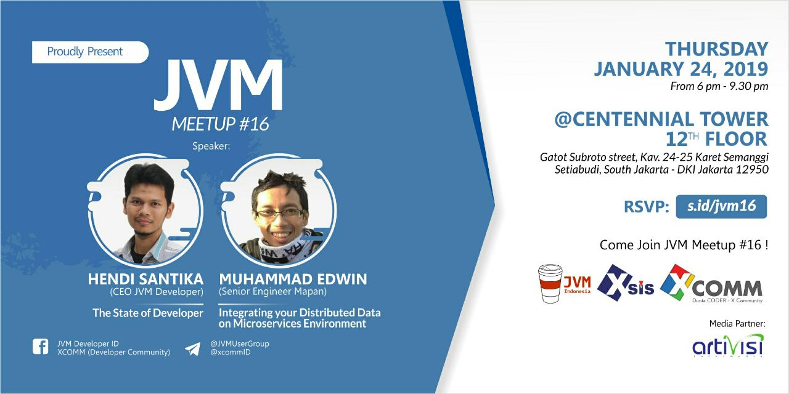

# JVM-Meetup-16

JVM-Meetup-16

Summarize from JVM Meetup #16 @ Centennial Tower

JVM Meetup #16 : JVM Roadmaps 2019

@ Centennial Tower 12 Floor

Jl. Gatot Subroto Kav. 24-25, RT.2/RW.2, Karet Semanggi, Kecamatan Setiabudi, Kota Jakarta Selatan, Daerah Khusus Ibukota Jakarta 12950

Speaker :

1. Hendi Santika (CEO JVM Indonesia ) -> [The State of Developer.](https://drive.google.com/open?id=1ABsb2YvJeomqbcZ1wyPMd_1O8ky1Tw-0)
2. Muhammad Edwin (Senior Engineer Mapan) -> [Integrating your distributed data on microservices environment.](https://drive.google.com/open?id=1EGF27VYXm2FEXSXHkeEclYo7BUj1ggA8)

Photo Session

Photo Session JVM Meetup 15

Ayo join JVM User Group di telegram untuk diskusi lebih lanjut.

Join Us : @JVMUserGroup

Like & Follow Instagram : JVM Developer ID

Like & Follow -> https://www.facebook.com/JVMDeveloperID/